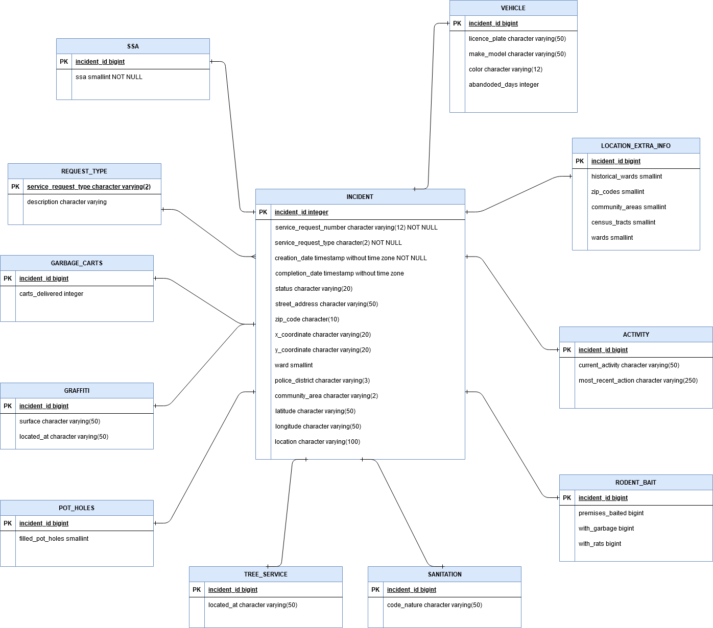

# 311-Chicago-Incidents

Design and implementation of a database solution to manage “311 Incidents” data openly published
by the city of Chicago, IL. It also provides access to this database through a web application. 

The database termed “311-Chicago-Incidents” or 311CI will be populated by data available at:

https://www.kaggle.com/chicago/chicago-311-service-requests.

Pertinent data of the above data set have to be stored in 311CI and can be used when the system
becomes operational.

Database Schema:

